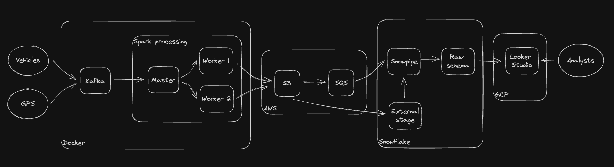

# Smartcity Realtime Pipeline

## Architecture



## Development

- Use locally

```bash
docker build --rm --compress -t poc/smartcity-kafka-spark:latest .
docker compose -f ./docker-compose.yml -p poc-smartcity-kafka-spark up -d
# Detached help to not to run in terminal
```

- Submit a job (execute)

```bash
docker exec -it poc-smartcity-kafka-spark-spark-master-1 spark-submit --master spark://spark-master:7077 --packages org.apache.spark:spark-sql-kafka-0-10_2.12:3.5.1,org.apache.hadoop:hadoop-aws:3.3.6,com.amazonaws:aws-java-sdk:1.12.666 jobs/spark-city.py
```

- Send messages to topics (execute)

```bash
python jobs/main.py
```

- Check topics in broker

```bash
kafka-topics --list --bootstrap-server broker:29092
```

- Check messages delivered to topic

```bash
kafka-console-consumer --topic vehicle_data --bootstrap-server broker:9092 --from-beginning
```

- Delete topics

```bash
kafka-topics --delete --topic vehicle_data --bootstrap-server broker:9092
```
